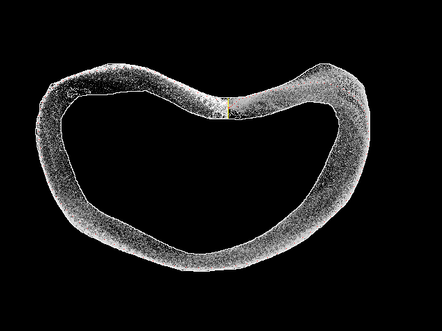
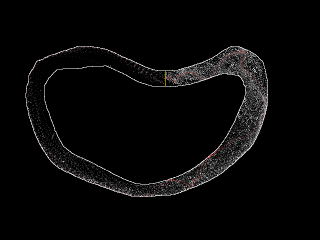

Reinforcement Learning Example
==============================

This is an example for a solution of a problem which might be prohibitively expensive to solve using non-probabilistic methods.  The problem is also chosen as one which work well with non-NN solutions, algorithms which are often drowned out in today's world focussed on neural networks.  What people forget is that many or even most solutions using neural networks also use other techniques in combination or series which can significantly increase the efficiency of the model.  It is therefore important to know about as many techniques as possible.

The program is implemented as a Python script for easy understanding.  It is not long and should therefore be understandable to the interested reader.  The script requires Python 3.  Some non-standard Python modules are needed but they are all available in the Fedora repository and can be installed with `dnf`.

Preparation
-----------

The inputs for the program come in two forms:
*   A PNG file with the picture of the track.
*   The various parameters specified as parameters.

### PNG of Track ###

The track should be a picture of the track.  Not a photo but instead just a drawing.  The file format is expected to be indexed 8-bit color PNG.  I.e., the file must contain a palette which is indexes by the byte-sized values which make up the actual picture.  Support for other types of image files could be added but is not present.

Five different colors are used with the following RGB values:
*   (255,255,0) which is yellow corresponds to the start/goal line.  The line must be vertical or horizontal
*   (255,0,0) which is red corresponds to the starting point which must be on the start line
*   (0,0,255) which is blue is the target of the first step and therefore defines the initial speed.  It is important to make this step valid
*   (0,0,0) which is black is the background where there is no goal line, starting point, first step, nor the edge of the track

Any other value corresponds to the edge of the track and/or the outside of the track.  It is not necessary to fill the outside of the track in this color but it could be done.  If only the edge of the track is given (as in the picture below) it is important that the edge line is a continuous line, fully horizontally or vertically connected.

### Parameters ###

The program provides for each of the parameters which can be used to influence the learning algorithm default values which can be seen when `python3 race.ph --help` is executed.  The parameters are part of the Q-function algorithm:

Q(s_t,a_t) <- (1-alpha) * Q(s_t,a_t) + alpha * (r_t + gamma * max_a Q(s_{t+1},a))

#### alpha ####

This is the learning rate which determines how quickly the results of next steps influence the prior step.  The value must be between 0.0 and 1.0.  It better should not be zero since this means no learning at all.  The default is 0.1 but smaller or larger values can and should be attempted.

#### gamma ####

This is the discount factor which determines how much weight future results are given.  The value must also be between 0.0 and 1.0 and again it better not be 0.0.  The default is 0.95.

#### Q_0 ####

The Q_0 value is the initial value for all inputs to the Q-function.  It value must be larger than Qfail (see below).  The default in 0.0 but larger values can lead to interesting results.  Large values will encourage more exploration.  In this implementation an alternative method to request exploration is present (controlled via epsilon, see below) and this might mean Q_0 is not needed.  Nevertheless it is present and ready for experimentation.

#### Qfail ####

In case the car leaves the track (crashes) the reward is value Qfail.  The default is -10000.

#### Qgoal ####

In case the car crosses the goal line the reward is Qgoal.  The default is 1000.

#### epsilon ####

The Q-learning algorithm picks in each state the action which promisses the best result.  This can be influenced with the Q_0 where a high value can encourage exploration until it is determined that the action does not lead to good results.

An alternative is to use a random, valid action in each state.  This is determined by alpha.  The value is between 0.0 and 1.0 and it determines the fraction of actions which are chosen randomly.  A value of 0.0 disables the random selection and Q_0 must be chosen apporiately.  If epsilon is chosen too high known good paths are unlikely followed again to the end.  The default is 0.01.  This means that 100 best actions are taken in about 37% of all cases.

#### N ####

The number of training rules.  The default value is 4,000,000 which might be a bit high for some computers.  The algorithm is probabilistic and guarantees the best (or even a good) solution only asymptotically.  The more runs are preformed the most likely it is that a good solution is found.

#### seed ####

To allow for reproducible results the random number generator can be seeded.  The same seed value is used in case multiple track names are given.  If no seed value is given the the produced random numbers are (hopefully) different every time.

Running the Program
-------------------

The program can be run from the command line or from the Python console (e.g., the IPython interactive session).

    $ python3 race.py --N 20000 track1
    track1: 100%|███████████████████████████| 20000/20000 [00:24<00:00, 809.97it/s]

The required positional parameters of the program name the tracks.  There are supposed to be PNG files with the filenames `FNAME.png` present in the current directory, where `FNAME` is the track name given on the command line.  More than one track name can be given in the same invocation; the tracks are worked on sequentially.

During the execution a progress bar is displayed (as can be seen above) which also shows the estimate for the remaining compute time.  The times can vary quite wildly: they depend on the random selections which are made all the time.

The output is a sequence of PNG files.  Those files contain the original track plus overlayed information about the currently learned information.  For each location (on the track, other locations do not qualify) with a positive Q-function value the a gray-scale value between black and whit relative to the value of the Q-function relative the maximal measure value.  I.e., high locations are more likely than dark ones.

In addition the best path is shown in the form of individual points.  There is no guarantee that there is a best path to the goal line, Q-learning is a probabilistic algorithm.  The path might end somewhere.  The distance between the indidual points represents the speed of the car.  You might need to zoom in to the picture to see the individual points.

Discussion
----------

The program provides a lot of opportunity to experiment and this should be taken advantage of to learn about reinforcement learning and Q-learning specifically.  It does not always have to be neural networks!

When reading the code it should become clear that the function for the algorithm to interact with the environment (the track) only uses local information.  I.e., it only looks at the current and next state and determines a reward value.  No global information such as location and diameter of the next corner are used.  And still the algorithm finds a solution and if given sufficient time, even the best solution.

Additionally, the implementation of the Q-learning algorithm is generic.  If some details are pulled out of the implementation in the `compute` function the code could be reused for a completely different problem.

One detail of the implementation cannot be changed from the command line: the reward function.  The given `getr` implementation is by no means the only or best implementation.  There might be significantly better implementations.

It is interesting to investigate earlier states of the learning process.  The following picture shows the result after just 20,000 runs.

We can see that latter parts of the track are not yet well explored.  More interesting is the "best" track at the beginning, though.  It is nowhere close to being a straight line.  This is easy to explain: the epsilon value was 0.1 and therefore the likelihood that a new run follows a non-catastrophic previous run in pretty high, even if that run makes a lot of turns.  Over time there will be runs where the random number generator decides even for the early steps in a run to diverge from the previously learned and explore.  Then it is likely the serpentine routes are going to be straightend out. 

Ulrich Drepper [<drepper@gmail.com>](mailto:drepper@gmail.com)